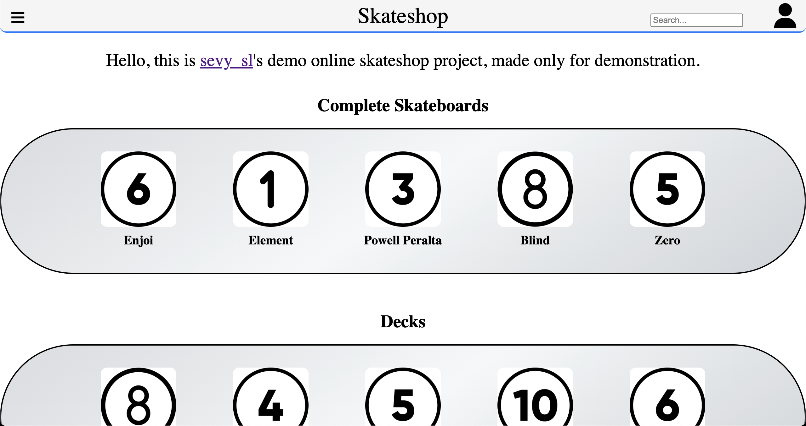
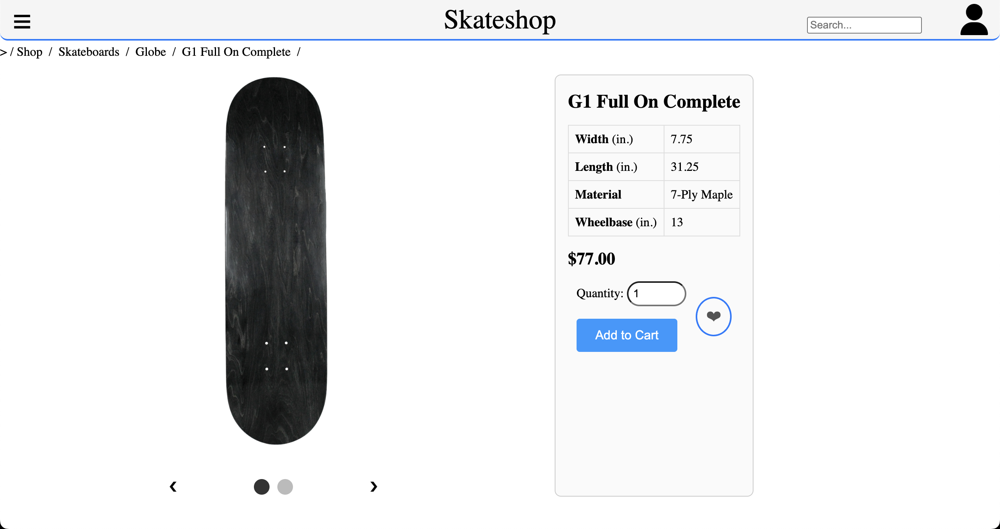

# SkateShop Demo Project

A Django-based demo project for skateboarding equipment, including complete skateboards, decks and trucks. The project simulates a full shopping experience with cart, favorites, orders and a fake checkout/payment flow.

---

## Overview

### Default Page



### Item Page



---

## Features

- Product catalog for skateboards, decks and trucks
- Product detail pages with attributes and images
- Shopping cart with quantity support
- Favorite (wishlist) system per user
- Order creation from cart
- Fake checkout/payment flow (no real payment provider)
- Search functionality across all products
- User authentication system
- Seed scripts for generating demo data

---

## Tech Stack

- Python 3
- Django
- SQLite
- HTML
- CSS
- JavaScript
- Pillow

---

## Project Structure

- store/ → products, brands, product models and catalog logic
- cart/ → shopping cart system
- orders/ → checkout and order handling
- user/ → profile, favorites and user pages
- seed_assets/ → images used for database seeding
- media/ → uploaded brand and product images

---

## Installation

### 1. Clone repository

```
git clone https://github.com/sevy-sl/Skateshop-Demo.git
cd Skateshop-Demo
```

### 2. Create virtual environment

```
python3 -m venv venv
source venv/bin/activate
```

Windows:

```
venv\Scripts\activate
```

### 3. Install dependencies

```
pip install -r requirements.txt
```

### 4. Environment variables

Create a .env file in the project root:

```
SECRET_KEY=your-secret-key
DEBUG=True
```

To generate a secret key:

```
python3 -c "from django.core.management.utils import get_random_secret_key; print(get_random_secret_key())"
```

### 5. Apply migrations

```
python3 manage.py makemigrations store user cart orders
python3 manage.py migrate
```

### 6. Seed database

The project includes a seed script that creates example brands, products and attachments.

```
python3 seed_items.py
```

The seed script creates:

- Complete skateboards
- Decks
- Trucks

### 7. Create admin user

```
python3 manage.py createsuperuser
```

### 8. Run server

```
python3 manage.py runserver
```

---

## Fake Checkout System

The checkout flow simulates a payment process:

- Cart items are converted into an order
- Order items are saved separately
- Cart is cleared after checkout
- A success message is shown to the user

No real payment provider is integrated.

---

## Notes

- This is a demo project and is not production-ready.
- The checkout/payment system is simulated.
- Images are stored locally in media/.
- SQLite is used as the default database.
- The project is designed for learning Django architecture and model relationships.